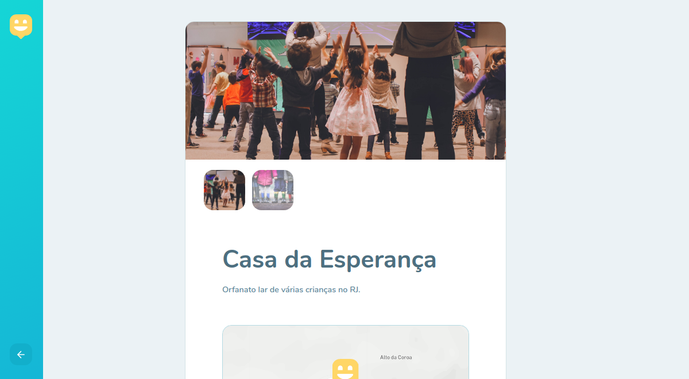
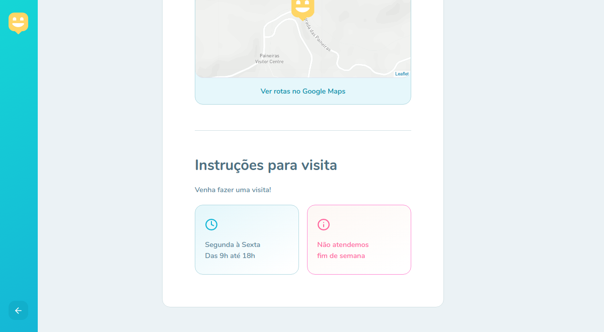
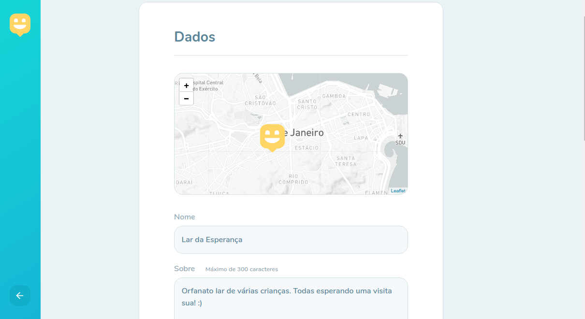
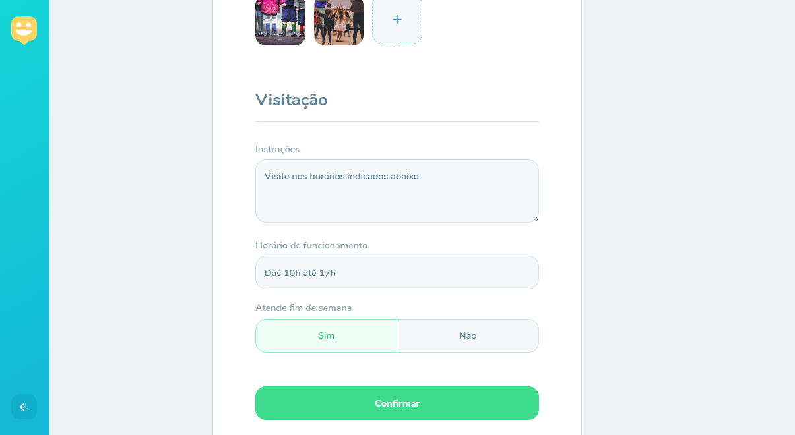
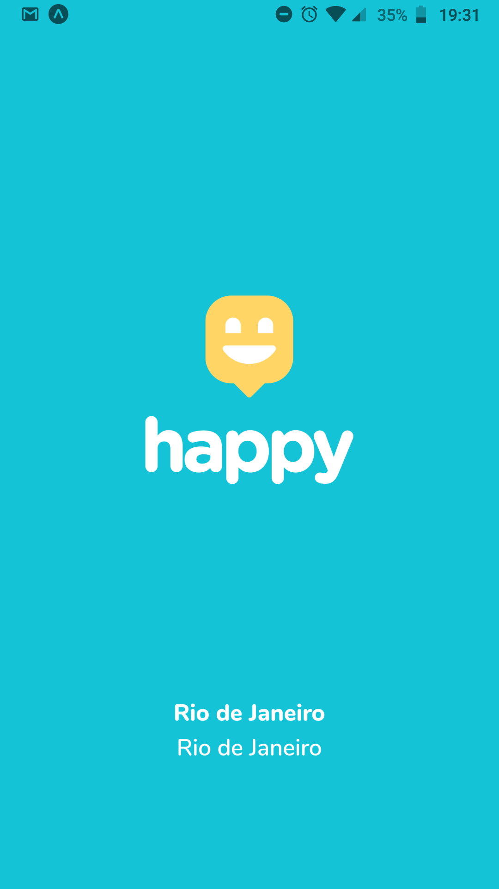
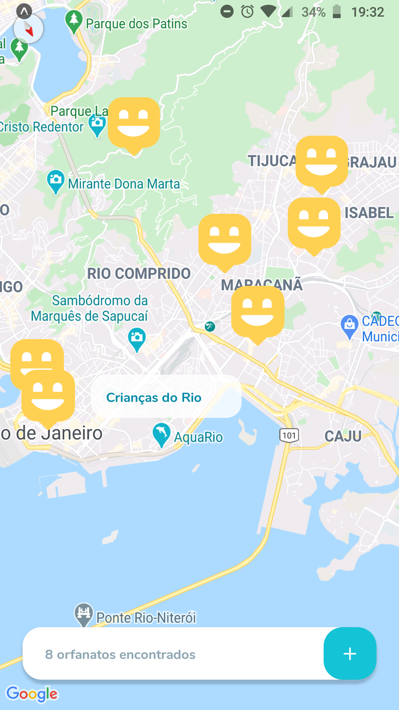
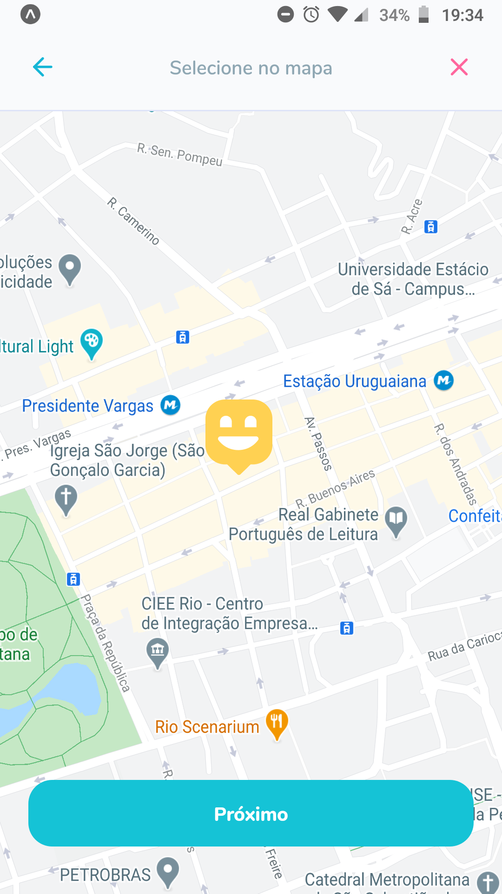
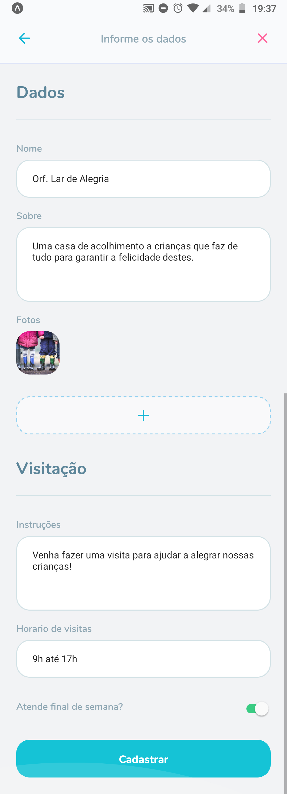
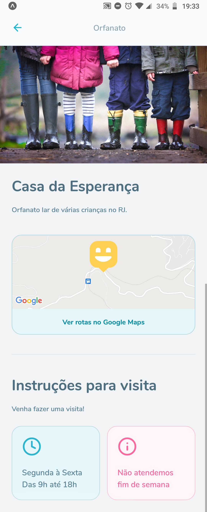
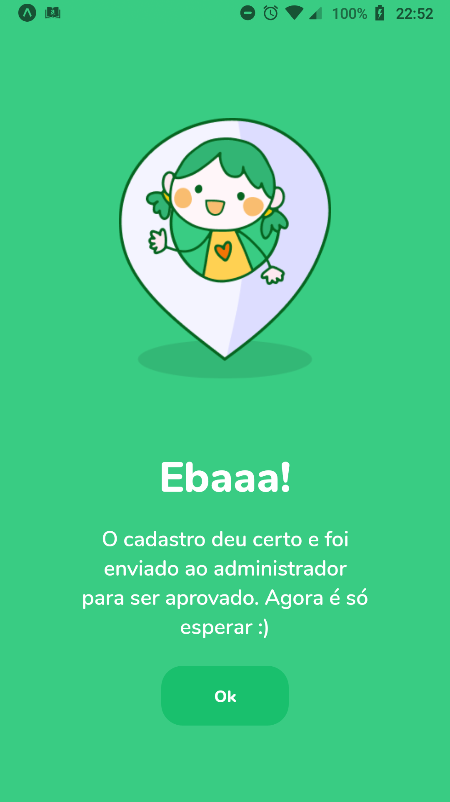

<h1 align="center" >
  
</h1>

<p align="center">Leve felicidade para o mundo, visite orfanatos e mude o dia de muitas crianças. NLW#3</p>

<h4 align="center"> 
	Versão 1.0 🚀
</h4>

<p align="center"> • 
 <a href="#-sobre">Sobre</a> •
 <a href="#-layout">Layout</a> • 
 <a href="#-rotas-do-backend">Rotas do Backend</a> • 
 <a href="#-executando-o-happy">Como executar</a> • 
 <a href="#tecnologias">Tecnologias</a> • 
 <a href="#como-contribuir">Como contribuir</a> • 
 <a href="#-licença">Licença</a> •
</p>

---

## 💡 Sobre

Essa aplicação permite que, se você faz parte de um orfanato, cadastre ele no mapa e caso você queira visitar um orfanato e fazer o dia de muitas crianças mais feliz, este é o lugar que vai encontrar os orfanatos mais perto de você, na cidade do Rio de Janeiro.

Este projeto foi construído durante a terceira edição do evento Next Level Week da [Rocketseat](https://rocketseat.com.br/).

---

## 🎨 Layout


### Web

<p align="center">
  

  
  
  
  
  
  
  
  
  
</p>

### Mobile

<p align="center">
  
  
  
  
  
</p>
<p align="center">
  
  
  
</p>

---

### Features da Versão 2.0

<p align="center">
  
</p>

<p align="center">
   
  
</p>


---

## 🍃 Rotas do Backend

GET - http://localhost:3333/orphanages --> Lista todos os orfanatos <br>
GET - http://localhost:3333/orphanages/:id --> Lista um orfanato<br>
POST - http://localhost:3333/orphanages --> Cadastra um novo orfanato<br>

---

## 💻 Executando o Happy

### Pré-requisitos

É necessário ter instalado na sua máquina para execução desse projeto:
- NodeJS
- Gerenciador de pacotes (Npm ou Yarn)

### ♊ Clonando o Repositório

```bash

$ git clone https://github.com/heyloh/happy.git

# entre na pasta do projeto

$ cd happy

```
### 💻 Rodando o Happy web

Entre na pasta

```bash

$ cd web

```
Instale as dependências

```bash

$ yarn

# ou, caso use npm

$ npm install

```

Rode a aplicação

```bash

$ yarn start

# ou, caso use npm

$ npm start

```

Caso você tenha uma conta no [mapbox](https://www.mapbox.com/), pode usar seu token para utilizar o mapa da aplicação. No entanto, se você não quiser 
ter este trabalho, sem problemas, por padrão já tem um mapa configurado para uso.

Caso queira, vá para a seção do <a href="#-mapbox">Mapbox</a>.

### 🌐 Rodando o Servidor

Entre na pasta

```bash

$ cd backend

```
Instale as dependências

```bash

$ yarn

# ou, caso use npm

$ npm install

```

Rode o servidor

```bash

$ yarn dev

# ou, caso use npm

$ npm dev

```

### 📱 Rodando o Happy mobile 

Entre na pasta

```bash

$ cd mobile

```
Instale as dependências

```bash

$ yarn

# ou, caso use npm

$ npm install

```

Rode o mobile

```bash

$ yarn start

# ou, caso use npm

$ npm start

```

Depois de fazer isso, irá abrir o metro bundler no seu navegador. A partir de agora você tem algumas opções para acessar o app.

#### 1 - Emulador Android
 Na página do metro bundler, clique em "Run on Android device/emulator" e espere carregar. Tenha em mente que é necessário ter passado pelo processo de instalação
 do android sdk, etc.

#### 2 - Emulador IOS
 Na página do metro bundler, clique em "Run on iOS simulator" e espere carregar.
 
#### 3 - Seu smartphone
 Baixe o aplicativo do Expo:
  - [iOS](https://itunes.apple.com/app/apple-store/id982107779)
  - [Android](https://play.google.com/store/apps/details?id=host.exp.exponent&referrer=www)
 
 Depois de baixar, volte a página do metro bundler e escaneie o QR Code com o app do Expo.

<br>

Se tudo deu certo, o app deve estar disponível agora! 👩🏽‍🔧

---

## 🗺 Mapbox

Siga as instruções para usar o mapbox no lugar do openstreetmap.

- Em "https://account.mapbox.com/", copie seu token.
- Na raiz do projeto web crie um arquivo chamado ".env"
- Dentro desse arquivo, digite "REACT_APP_MAPBOX_TOKEN =" e cole seu token logo depois.
- Entre no arquivo "OrphanagesMap.tsx", descomente o trecho de código correspondente as linhas 34, 35 e 36.
- No mesmo arquivo, comente a linha 32.

Se você fez tudo corretamente, estás usando a API do mapbox com seu Token na página do mapa. 😄

---

<h2 id="tecnologias"> 🛠️ Tecnologias </h2>

As ferramentas usadas no desenvolvimento do projeto.

#### Backend:
 - Typescript
 - NodeJS
 - Express
 - Express Async Errors
 - TypeORM
 - SQLite
 - Multer
 - Yup
 - Cors

#### Web:
- Typescript
- ReactJS ⚛️
- React Router Dom
- React Icons
- Leaflet 🍃
- API do Mapbox 🗺️
- Axios

#### Mobile:
- Typescript
- React Native
- React Native Maps
- React Navigation
- React Navigation Stack
- Expo
- Expo Fonts
- Expo Google Fonts - Nunito


---

<h2 id="como-contribuir"> ⚙️ Como contribuir </h2>

- Faça um fork desse repositório;
- Crie uma branch com a sua feature: `git checkout -b minha-feature`;
- Faça commit das suas alterações: `git commit -m 'feat: Minha nova feature'`;
- Faça push para a sua branch: `git push origin minha-feature`.

---

## 📝 Licença

Este projeto está sob licença [MIT](./LICENSE).

<p>Feito com 💙 por Lohana Torres</p>

