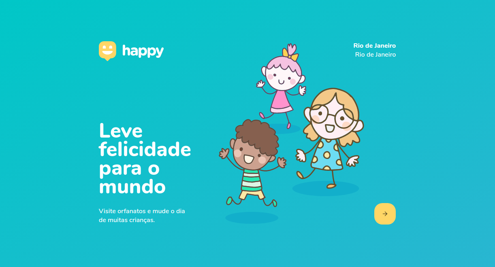
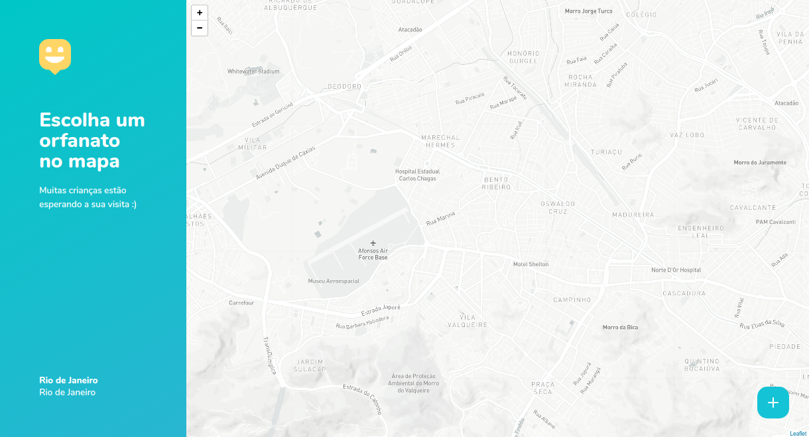

<h1 align="center" >
  
</h1>

<p align="center">Leve felicidade para o mundo, visite orfanatos e mude o dia de muitas crianças. NLW#3</p>

<h4 align="center"> 
	🚧  Em construção...  🚧
</h4>

<p align="center">
 <a href="#-sobre">Sobre</a> •
 <a href="#-layout">Layout</a> • 
 <a href="#-executando-o-happy">Como executar</a> • 
 <a href="#-tecnologias">Tecnologias</a> • 
 <a href="#-licenca">Licença</a> 
</p>

---

## 💡 Sobre

Essa aplicação permite que, se você faz parte de um orfanato, cadastre ele no mapa e caso você queira visitar um orfanato e fazer o dia de muitas crianças mais feliz, este é o lugar que vai encontrar os orfanatos mais perto de você, na cidade do Rio de Janeiro.

Este projeto foi construído durante a terceira edição do evento Next Level Week da [Rocketseat](https://rocketseat.com.br/).

---

## 🎨 Layout


### Web

<p align="center">
  

  
</p>

---

## 💻 Executando o Happy

### Pré-requisitos

É necessário ter instalado na sua máquina para execução desse projeto:
- NodeJS
- Gerenciador de pacotes (Npm ou Yarn) 

> Em breve mais detalhes...

### ♊ Clonando o Repositório

```bash

$ git clone https://github.com/heyloh/happy.git

# entre na pasta do projeto

$ cd happy

```
### 💻 Rodando o Happy web

Entre na pasta

```bash

$ cd web

```
Instale as dependências

```bash

$ yarn

# ou, caso use npm

$ npm install

```

Rode a aplicação

```bash

$ yarn start

# ou, caso use npm

$ npm start

```

Caso você tenha uma conta no [mapbox](https://www.mapbox.com/), pode usar seu token para utilizar o mapa da aplicação. No entanto, se você não quiser 
ter este trabalho, sem problemas, por padrão já tem um mapa configurado para uso.

Caso queira, vá para a seção do <a href="#-mapbox">Mapbox</a>.

### 🌐 Rodando o Servidor

> Em breve...

### 📱 Rodando o Happy mobile 

> Em breve...

<br>

Se tudo deu certo, o app deve estar disponível agora! 👩‍🔧

---

## 🗺 Mapbox

Siga as instruções para usar o mapbox no lugar do openstreetmap.

- Em "https://account.mapbox.com/", copie seu token.
- Na raiz do projeto web crie um arquivo chamado ".env"
- Dentro desse arquivo, digite "REACT_APP_MAPBOX_TOKEN =" e cole seu token logo depois.
- Entre no arquivo "OrphanagesMap.tsx", descomente o trecho de código correspondente as linhas 34, 35 e 36.
- No mesmo arquivo, comente a linha 32.

Se você fez tudo corretamente, estás usando a API do mapbox com seu Token na página do mapa. 😄

---

## 🛠️ Tecnologias

As ferramentas usadas no desenvolvimento do projeto.

#### Backend:
> Em breve...

#### Web:
- Typescript
- ReactJS ⚛️
- React Router Dom
- React Icons
- Leaflet 🍃
- API do Mapbox 🗺️

#### Mobile:
> Em breve...

---

## 📝 Licença

Este projeto está sob licença [MIT](./LICENSE).

<p>Feito com 💙 por Lohana Torres</p>

